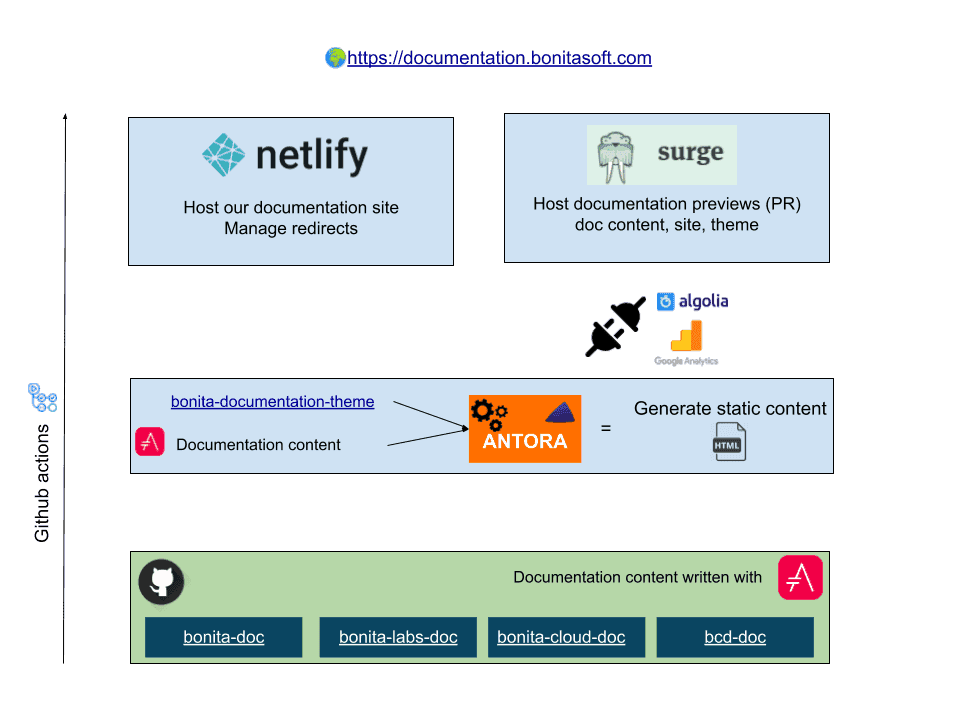

= Documentation Site architecture

This document provides details on the architecture of the documentation site, in order to ease future developments.

== Chore solution: https://antora.org/[Antora]

Antora is a multi-repository documentation site generator.

The Antora playbook is configured by the file _antora-playbook.yml_. +
This configuration file lists all the components, and the branches to build. It also references the UI bundle and some additional Asciidoctor extensions, both used to generate the HTML.

The Antora generator retrieves AsciiDoc sources from our documentation content repositories, and then generate a static HTML website from those sources.

[NOTE]
====
A GitHub workflow is available to generate this static documentation (useful for oldest version not host on this documentation site).
====

== UI Bundle

The UI bundle source repository can be found here: https://github.com/bonitasoft/bonita-documentation-theme[bonita-documentation-theme].

The UI Bundle architecture is detailed on the UI bundle Readme.

== Search solution: DocSearch

https://docsearch.algolia.com/[DocSearch by Algolia] offers us freely a search solution (Thanks a lot to them! ❤️). +
The configuration is available in the https://crawler.algolia.com/admin/crawlers[DocSearch crawler admin page (restricted access)].

== Host solution: Netlify

The documentation is hosted on https://app.netlify.com/sites/documentation-bonita[Netlify].

Netlify allow us to manage redirection with the `netlify.toml` file at root of this repository.

== Preview with Surge

https://surge.sh/[Surge] let us deploy previews for the

* theme development
* site development
* documentation preview when updating the content with Pull Requests

