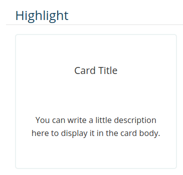

= Contributing to the Bonita documentation
:icons: font
ifdef::env-github[]
:note-caption: :information_source:
:tip-caption: :bulb:
:important-caption: :heavy_exclamation_mark:
:caution-caption: :fire:
:warning-caption: :warning:
endif::[]

We are pleased to receive any kind of contribution (issues, pull requests, suggestions ...).

== Contribution check

Before open a pull request, please check our few recommendations:

Verify that each updated `adoc` file starts with:

[source,adoc]
----
= A short title
:description: Put just after title (without whitespace) a little description to explain what we can retrieve in this page.

You can put you content after metadata block
----

NOTE: This metadata information is useful to improve our visibility for search engine (SEO)

== Asciidoc

https://docs.asciidoctor.org/asciidoc/latest/[Asciidoc] is the markdown language chosen to write our documentation content. You can check the official documentation site to learn more on Asciidoc syntax.

WARNING: WIP

== Antora

We are using https://docs.antora.org/[Antora] to generate the Bonita documentation.

WARNING: WIP

=== Tips and tricks

We will give some tips and tricks already use and available in our documentation site.

==== Asciinema

https://asciinema.org/[Asciinema] provides a great way for sharing shell sessions recording, making documentation more lively !

Once you have created a `.cast` file, you can add it to your document with the following markup

.sample asciinema adoc.
[source, asciidoc]
----
== Asciinema embedded

Example of embedded asciinema recording:

++++
<asciinema-player src="_images/images/<path_to_your_cast_file>.cast" speed="2" theme="monokai" title="Example of embedded asciinema recording" cols="240" rows="32"></asciinema-player>
++++
----

The generated asciidoctor (before transformation by Antora) document should render like something like this:
[.thumb]
image::images/asciinema_sample_rendering.png[]

==== Cards

You can use card style in your page. Please don't abuse it, and try to only use it on index pages.

.Card display in after HTML generation

You can update *link*, *title* and description for each card.

To do it, you need to use this following syntax:

[source,adoc]
----
[.card-section]
== Highlight

[.card.card-index]
--
yourInternalOrExternalLink[[.card-title]#Card Title# [.card-body.card-content-overflow]#pass:q[You can write a little description here to display it in the card body.]#]
--

----

You can use many card in same card section. +
Please keep this technical syntax to avoid error.

NOTE: If you wanna see a real example, please consult the index.adoc file in https://github.com/bonitasoft/bonita-doc/blob/7.12/md/index.md[bonita documentation github repository].

WARNING: If description in card body is too long (more than 3 lines), we will hide the excess.

==== Variables and attributes

Some attributes are available and define in antora.yml at repository root and could be use in content page.

[source,yml]
----
asciidoc:
  attributes:
    varVersion: 2021.1
----
[example]
 Use *{varVersion}* syntax to reference this attributes. It will be replaced by 2021.1 for each occurrence.

==== GitHub may not render admonitions

See https://docs.asciidoctor.org/asciidoc/latest/blocks/admonitions/#using-emoji-for-admonition-icons

==== Antora modules

You can use Antora modules to clarify content (for instance, getting-started guides, how-to articles). +
See https://docs.antora.org/antora/2.3/module-directories/#module.

[quote]
____
Modules allow to better separate content and resources (for instance specific images and
attachments). For Bonita doc, this will avoid for instance to have all "getting started" pages at
the same level as other pages (currently in the md folder): easier to identify what pages and images
are related to "getting started", easier maintenance, ....
____

==== Alias when renaming pages

IMPORTANT: Impact on SEO

See https://docs.antora.org/antora/2.3/page/page-aliases. +
Successfully experimented in https://github.com/bonitasoft/bonita-ici-doc#123

==== Adding link between two components

You can reference to documentation pages of another component: for instance, bcd doc has links the to bonita doc. To
avoid hard coded url, use https://docs.antora.org/antora/2.3/page/page-id/ (see https://opendevise.com/blog/referencing-pages/ for rationale). Warn: won't work with PR preview in the document content repository, as that kind of preview only build a single component version

==== Examples

The `examples` directory can be used to store source code which can then easily be integrated in the documentation. +
See https://docs.antora.org/antora/2.3/examples-directory/

This allows user to download the source as attachments by providing a link directly for the code (no duplication between
the actual examples and the documentation)

== How to integrate a new component

WARNING: WIP

Add a new source in the antora playbook and reference a new branch

== How to integrate a new version of an existing component

WARNING: WIP

Create a new branch in the repository related to the component
Add an antora configuration file: version + prerelase flag if needed
Declare the new branch in the antora playbook
Update the docsearch configuration

