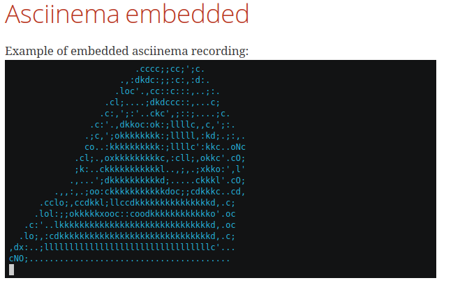

= Contribute to the Bonita documentation
:icons: font
ifdef::env-github[]
:note-caption: :information_source:
:tip-caption: :bulb:
:important-caption: :heavy_exclamation_mark:
:caution-caption: :fire:
:warning-caption: :warning:
endif::[]

We are pleased to receive any kind of contribution (issues, pull requests, suggestions ...).

== Contribution check

Before open a pull request, please check our few recommendations:

Verify that each updated `adoc` file starts with:

[source,adoc]
----
= A short title
:description: Put just after title (without whitespace) a little description to explain what we can retrieve in this page.

You can put you content after metadata block
----

NOTE: This metadata information is useful to improve our visibility for search engine (SEO)

== Asciidoc

https://docs.asciidoctor.org/asciidoc/latest/[Asciidoc] is the markdown language chosen to write our documentation content. You can check the official documentation site to learn more on Asciidoc syntax.

== Antora

We are using https://docs.antora.org/[Antora] to generate the Bonita documentation.

==== Asciinema

https://asciinema.org/[Asciinema] provides a great way for sharing shell sessions recording, making documentation more lively !

Once you have created a `.cast` file, you can add it to your document with the following markup

.sample asciinema adoc.
[source, asciidoc]
----
== Asciinema embedded

Example of embedded asciinema recording:

++++
<asciinema-player src="_images/images/<path_to_your_cast_file>.cast" speed="2" theme="monokai" title="Example of embedded asciinema recording" cols="240" rows="32"></asciinema-player>
++++
----

The generated asciidoctor (before transformation by Antora) document should render like something like this:
[.thumb]

==== Cards

You can use card style in your page. Please don't abuse it, and try to only use it on index pages.

.Card display in after HTML generation
You can update *link*, *title* and description for each card.

To do it, you need to use this following syntax:

[source,adoc]
----
[.card-section]
== Highlight

[.card.card-index]
--
yourInternalOrExternalLink[[.card-title]#Card Title# [.card-body.card-content-overflow]#pass:q[You can write a short description here to display it in the card body.]#]
--

----

You can use many card in same card section. +
Please keep this technical syntax to avoid error.

NOTE: If you wanna see a real example, please consult the index.adoc file in https://github.com/bonitasoft/bonita-doc/blob/7.12/md/index.md[bonita documentation github repository].

WARNING: If description in card body is too long (more than 3 lines), we will hide the excess.

==== Variables and attributes

Some attributes are available and define in antora.yml at repository root and could be use in content page.

[source,yml]
----
asciidoc:
  attributes:
    varVersion: 2021.1
----
[example]
 Use `{varVersion}` syntax to reference this attributes in content. It will be replaced by 2021.1 for each occurrence.

===== Disabling attribute substitution

To avoid asciidoctor 

Any elements around braces are interpreted as attribute and so, Asciidoctor tries to substitue them. If the value around braces is not related to
a declared attributes, warnings are emitted when generating the html files. +
For instance, in `+${CATALINA_HOME}/conf/jaas.cfg+`, Asciidoctor tries by default to stubstitue `CATALINA_HOME` which is not something we want
as we want to document an example with bash substitution.

To disable attribute substitution in inline text, add a `+` character around the text that contains the braces like `\+${CATALINA_HOME}/conf/jaas.cfg+`.

See https://docs.asciidoctor.org/asciidoc/latest/pass/pass-macro/#inline-passthrough-macros for more details.

===== Attributes substitution in blocks

Notice that by default there is no attribute substitution in blocks, so extra configuration is needed in that case.
More details are available in https://docs.asciidoctor.org/asciidoc/latest/subs/apply-subs-to-blocks/

We recommend to use explicit macro on part of the block that requires substitution. This allow to mix the `{..}` for elements that
should not been substituted (for instance, maven properties or bash variables).

In the block, enable the macros by adding the `subs` configuration like `[source,xml,subs="+macros"]` and in the block content, set `pass:a[{...}]` around
the attribute you want to substitue. For instance, `<bonita.version>pass:a[{varVersion}].0</bonita.version>`. +
This configuration then let parts like `<version>${bonita.version}</version>` not substituted.

It is also possible to configure substitution globally for the block (see the documentation).

==== GitHub may not render admonitions

https://docs.asciidoctor.org/asciidoc/latest/blocks/admonitions/#using-emoji-for-admonition-icons[See to more details]

==== Antora modules

You can use Antora modules to clarify content (for instance, getting-started guides, how-to articles). +
See https://docs.antora.org/antora/2.3/module-directories/#module.

[quote]
____
Modules allow to better separate content and resources (for instance specific images and
attachments). For Bonita doc, this will avoid for instance to have all "getting started" pages at
the same level as other pages (currently in the md folder): easier to identify what pages and images
are related to "getting started", easier maintenance, ....
____

==== Alias when renaming pages

IMPORTANT: Impact on SEO

See https://docs.antora.org/antora/2.3/page/page-aliases. +
Successfully experimented in https://github.com/bonitasoft/bonita-ici-doc#123

==== Adding link between two components

You can reference to documentation pages of another component: for instance, bcd doc has links the to bonita doc. To
avoid hard coded url, use https://docs.antora.org/antora/2.3/page/page-id/ (see https://opendevise.com/blog/referencing-pages/ for rationale). Warn: won't work with PR preview in the document content repository, as that kind of preview only build a single component version

==== Examples

The `examples` directory can be used to store source code which can then easily be integrated in the documentation. +
See https://docs.antora.org/antora/2.3/examples-directory/

This allows user to download the source as attachments by providing a link directly for the code (no duplication between the actual examples and the documentation)

== How to integrate a new component

Add a new source in the Antora playbook and reference a new branch. In this branch, put a `antora.yml` file at root which contains:

[source,yml]
----
name: componentName
title: yourTitle
version: yourVersion
asciidoc:
 attributes:
  varVersion: 7.8
nav:
- modules/ROOT/taxonomy.adoc
----

== How to integrate a new version of an existing component

When we need to add a new version of one component, we need to:

. Create a new branch (in the repository related to the component
. To add a new component, you first need to create a Github repository which will contain the asciidoc sources of this component (i.e the documentation content). This repository must be organized according to the https://docs.antora.org/antora/2.3/organize-content-files/[Antora recommendations]. You can check existing repositories for working examples.
. Then, you need to add a new source in the https://github.com/bonitasoft/bonitasoft.github.io/blob/master/antora-playbook.yml[Antora playbook]. A source references the URL of the repository and all the branches to retrieve.
. Finally, you have to update the https://github.com/algolia/docsearch-configs/blob/master/configs/bonitasoft.json[search configuration] to make this component searchable.

== How to remove a component version

NOTE: this mainly applies to Bonita Platform but all components with multi-supported versions should follow the same rules

On new Bonita Platform GA release, an old version must be archived.

. Take the oldest one
. Run the archive GitHub Actions: this create a new tag on the related component version
. Create a PR targetting the bonita-doc archives branch and add the new archive version to the list
. Remove the version from the Antora Playbook
. Remove the version from the Algolia DocSearch configuration
. .... more info here

== Out of support versions

NOTE: this mainly applies to Bonita Platform but all components with multi-supported versions should follow the same rules

when: On new Bonita Platform GA release, an old version is considered as out of support.

Edit the related antora.yml file of the component version, and make the pages non editable

[source,yml]
----
name: componentName
....
asciidoc:
  attributes:
    # remove the 'Edit this Page' link in all pages 
    page-editable: false
    # display a dedicated banner to warn the reader about the out-of-support state
    page-out-of-support: true
----
