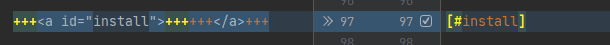

= Documentation content conversion steps
:icons: font

The following describes how to convert content repository branch from Markdown for the old documentation site to Asciidoctor
for the new documentation site using Antora.

The steps describe here are supposed to be followed in the order they appear.

== New branch content initialization

Create a new branch starting from the existing one.

See explanation and images in xref:migration-steps-put-the-site-live.adoc[global migration steps documentation].

== Branch cleanup

The documentation content branch for the old documentation site also contained scripts and extra files that are not needed anymore.
They should be removed as part of the initial conversion.

See https://github.com/bonitasoft/bonita-ici-doc/pull/118[BICI Doc PR #118] for an example.

== Markdown to Asciidoctor conversion

=== Tool installation

TIP: Proposed tool Kramdoc aka https://github.com/asciidoctor/kramdown-asciidoc:[kramdown-asciidoc]. See also this https://matthewsetter.com/technical-documentation/asciidoc/convert-markdown-to-asciidoc-with-kramdoc/:[article].

* Require Ruby
* gem install kramdown-asciidoc, see the https://kramdown.gettalong.org/installation.html:[installation guide] for more details
* installation check: `kramdoc --version`

*TODO*: docker ruby image with gem installed to avoid polluting our machines?

=== Convert sources

Sources (markdown and images files) are stored in the `md` folder of the documentation content repository.

[CAUTION]
====
The index page generally contains html elements that cannot be automatically converted (some other pages way also be impacted). +
There is also a dependency on font-awesome css (`fa-` directives). Font awesome support is available in Asciidoctor

For such a page, the html part must be commented prior running conversion otherwise the process fails.
====

Markdown source files are stored in the md folder of the repository. +
From this folder, run the following command to generate the converted files:
[source,bash]
----
find ./ -name "*.md" \
       -type f | xargs -I @@ \
       bash -c 'kramdoc \
               --format=GFM \
               --output=@@.adoc @@';
----

WARNING: test with additional `--wrap=ventilate` option

=== Rename Asciidoctor files and remove old markdown files

From `md.adoc` to `.adoc`.

[source,bash]
----
for f in *.md.adoc; do mv -- "$f" "${f%.md.adoc}.adoc"; done
# Remove remaining md files
rm -rf *.md
----

=== Final steps

Then commit the changes: at that point, git should have detected that the files have been renamed, at least for some of them
(check in the git history).
You can also start reviewing the converted content. Some issues will remain, they will be fixed later (see *TODO add link to manual cleanup*)

== Prepare files for Antora

=== Move files to the right folder

[NOTE]
====
This is required to follow the https://docs.antora.org/antora/2.3/standard-directories/[Antora directories structure]
====

* rename the `md` folder into `modules/ROOT/pages`
* taxonomy: move the page to `modules/ROOT`, otherwise it is considered as a regular pages

==== Move Images

CAUTION: in progress, a definitive solution must be found

[WARNING]
====
Antora expects (at least by default, see https://docs.antora.org/antora/2.3/images-directory/) that images are stored in the `modules/ROOT/assets/images`
folder, then they are available directly in pages as link without having to add a relative path. In the generated site, they are then stored in the `_/_images`
folder.

In the original markdown content, the images are accessed through the `images` relative folder. So, if the page content
is not changed, the images must be stored in a `images` folder of the Antora images folder, so in `modules/ROOT/assets/images/images` (double `images` part
in the path).

We may also have a look at the https://asciidoctor.org/docs/user-manual/#builtin-attributes[imagesdir Asciidoctor attribute]
====

=== Create the Antora configuration file

See https://docs.antora.org/antora/2.3/component-version-descriptor/

The version defined in the configuration file depends on the <<migration-strategy-per-repository, documentation content repository>>.

== Testing the new content in the documentation site

Update the Antora Playbook to reference the new Documentation repository and/or branch. +
See https://docs.antora.org/antora/2.3/playbook/configure-content-sources/

No need to push the documentation content, this can be done locally.

== Post conversion manual processing

The following explanations provide ways to fix html generation errors and warnings that can be seen in the console while
generating the site or when visually checking the rendered site.

=== Old custom tags cleanup

Convert custom 'Bonita' tags for notes, warnings, ....

For instance, `:::info Note: for Enterprise, Performance and Efficiency editions only.:::` to
`NOTE: Note: for Enterprise, Performance and Efficiency editions only.`

[source,bash]
----
sed -i 's/::: info/NOTE:/g' *.adoc
sed -i 's/:::info/NOTE:/g' *.adoc
sed -i 's/::: warning/WARNING:/g' *.adoc
sed -i 's/:::warning/WARNING:/g' *.adoc
sed -i 's/::://g' *.adoc
----

NOTE: for macOS add `''` after the -i option.

[WARNING]
====
The note conversion should be improved as very often, the md content have an extra `Note` word to introduce the explanation,
which is now useless. +
// the \ before the * is to have a correct rendering of this page
This introduction can be `\*Note:* ` (with an ending space)

The conversion commands works if the content is on the same line as the header
We should use the https://asciidoctor.org/docs/user-manual/#admonition[admonition syntax] that supports multilines
====

=== Anchor link update

After conversion to adoc format, we got some anchor with bad syntax. To replace it by ascidoctor syntax, run :

[source,bash]
----
sed -i -E 's/^\+\+\+<a id="(.+)">\+\+\+\+\+\+<\/a>\+\+\+$/[#\1]/g' *.adoc
----

In each file you should get update like this:

NOTE: for macOS add `''` after the -i option.

=== HTML Content manual conversion

WARNING: For now, we don't have a solution, see https://github.com/bonitasoft/bonitasoft.github.io/issues/40[issue #40]

This is the content that has been commented generally in the index page.

=== Fix the Taxonomy file: links targeting non-existing page

NOTE: This has been detected while converting Bonita 7.5 and probably impact all Bonita versions

Most collapsed entries related to generated pages (listing subpages only) in the markdown solution, so a link was available.
There is no more generated page with Antora, so replace link by raw text.

=== Links still containing a reference to a markdown file

WARNING: root cause to be confirmed

*TODO*: provide a single sed (or an equivalent command) to fix this massively because they are a lot of links like this.

After conversion, a successfully converted link uses the `xref` directive. But, we also see links converted using the `link`
directive and pointing to a `md` file.
For instance, in Bonita 7.5, in the release-notes: `link:software-extensibility.md#stable_extension_points`

It seems that link containing an anchor are not correctly converted.

=== Fix broken links

==== Detection
In the generated html page, the links have a `unresolved` CSS class (generally, the produced html contains `class="page unresolved"`).
See this https://github.com/bonitasoft/bonitasoft.github.io/commit/8b2485800cbeaf8924ab3d4317cdb7e595541338#diff-c57f6e0008151cc92f79f21a76ffcc37334c2a11e7d3185db1e1daa2d55d3f1fL1190[commit that fixes such an issue].

==== Links targeting old generated taxonomy pages

NOTE: This has been detected while converting Bonita 7.5 and probably impact all Bonita versions

There is no more pages generated from the taxonomy so links targeting such page must be updated.

For instance, in Bonita 7.5:

* index.adoc: link to the taxonomy index page in the `Explore Bonita`
* software-extensibility.adoc: replace `xref:_connectivity.adoc` by `xref:connectivity-overview.adoc` (introduction to connectivity)

==== Already existing dead links

NOTE: This has been detected while converting Bonita 7.5 and probably impact all Bonita versions

For instance:

* set-up-continuous-integration.adoc
`xref:automating-process-builds.adoc` by `xref:automating-builds.adoc`

=== Wrongly migrated numbered list

NOTE: Detected while converting Bonita 7.5 and probably impact all Bonita versions

When code example is present in numbered list, the code example is not converted and the subsequent text is kept in the
markdown form. +
This impacts a few pages so manual migration can be managed

Detected in Bonita 7.5

* connector-development-toolkit.adoc (_asciidoctor: WARNING: connector-development-toolkit.adoc: line 75: list item index: expected 1, got 4_)
* enforce-password-policy.adoc (_asciidoctor: WARNING: enforce-password-policy.adoc: line 43: unterminated listing block_)
* ssl.adoc (_asciidoctor: WARNING: ssl.adoc: line 36: unterminated listing block_)

=== Not migrated page

NOTE: Detected while converting Bonita 7.5 and probably impact all Bonita 7.5+ versions (not seen with Bonita 7.3, but
could exist in Bonita 7.4)

The web-service-tutorial.md conversion failed with error due to an `xml declaration` in a source code example.
Removing this element from the example makes the conversion work.

In addition, after conversion, this page has the following issues

* wrongly converted 'bold italic' elements
* the 'numbered list with code example issue': web-service-tutorial.adoc
(_asciidoctor: WARNING: web-service-tutorial.adoc: line 70: unterminated listing block_)

=== Wrong headers in source page

This generates site generation errors like in the following
----
ERROR: building-community-edition-from-source.adoc: line xx: invalid part, must have at least one section (e.g., chapter, appendix, etc.)
----
