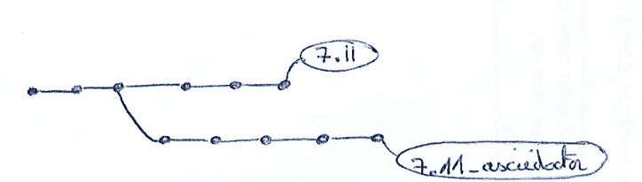
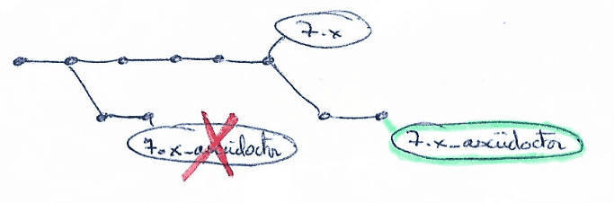
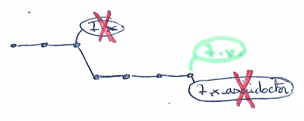

= Migration steps to put the new site live
:icons: font

CAUTION: early draft

== Documentation content strategy while migrating

Everything is done at branch management level

* all existing branches must be kept untouched as they are used by the old doc site solution
* we are creating new branches based on the existing ones, then xref:doc-content-conversion-from-md-to-adoc.adoc[convert the content from markdown to asciidoctor]
  * for `out-of support version` branch: we can convert the branch while developing the new documentation site. The branch for out-of-support version are no more updated
  * for `supported version` branch: they have to be converted for testing, need to be removed prior the actual migration
    * at least some of them to check if we expect conversion issues
   *  for sure, the latest supported version for each component,
* branch naming convention: `7.4` converted into a new branch based on `7.4` named `7.4_asciidoctor`

=== Strategy in images

==== `out-of support version` branches

==== `supported version` branches while developing the new documentation site

==== `supported version` branches while putting the new documentation site live

We could redo the conversion part from scratch and backport manual changes applied to adjust the doc after conversion.

==== branches after the new documentation site is live

[[migration-strategy-per-repository]]
=== Strategy per repository

==== bonita-doc

Strategy: mixed

* out-of-support version branches from `7.3` to `7.7` (and `7.8` starting from December 2020): convert them right away
* supported version branches: at least few versions are temporary converted to test the new documentation site

==== bonita-ici-doc

NOTE: BICI is now in `labs` mode only, there is no more need to document various versions. We will only keep a single
branch.

Strategy:

* convert right away as we are going to keep only a single branch.
* single new branch: `master`
* the former `1.x` existing branches will be kept

See also https://github.com/bonitasoft/bonita-documentation-site/issues/11[#11] and https://github.com/bonitasoft/bonita-documentation-site/issues/175[#175]

==== bonita-continuous-delivery-doc

* out-of-support version branches from `1.0` to `?` (and `?` starting from December 2020): convert right away
* supported version branches: same as for bonita-doc

==== bonita-cloud-doc

There is a single `master` branch as bonita-cloud is version-less.

Strategy:

* temporary conversion while developing and remigrate from scratch when switching to the new site
* single new branch: `master_asciidoctor`

== Latest migration preparation

* x days prior the migration, warn opened PR: merge them or notice that recreation/migration will be later needed
* if we want to block PR merge while the actual migration, we can set up GH branch rules that never pass (we can disable the rules for administrators i.e. us)
  * request PR in the doc content repositories to be reviewed by 10 people prior merging
  * enforce PR creation to be able to merge to content branch
  * ...

== Migrate remaining doc content

* delete doc content branches that must be recreated (see <<migration-strategy-per-repository>>)
* recreate the branches and migrate them
* check that out-of-support version branches have not been modified (this shouldn't occur). If so, decide whether backport changes

== D-Day Switch

=== bonita-documentation-site repository

update the antora playbook

* site.url: https://documentation.bonitasoft.com

=== Search

Update the DocSearch configuration: use the new domain

=== Hosting

* add a new Netlify Custom Domain and make it use the final https://docs.netlify.com/domains-https/custom-domains/[custom domain]

[WARNING]
====
to be investigated

we probably need to keep the preview domain for docsearch:

* until the crawler has been run using the new url, the preview one must be available
* once the new domain has crawled, the preview domain can be removed from netlify and from the DNS
====

=== infra

* update DNS: warn propagation can take time, decide how to do the switch
* disable webhooks configured on doc content repositories that target the internal Bonitasoft CI
  * BICI doc webhooks have already been disabled on 2020-11-26 as there was no update on 1.x branch and the new master branch
made the builds fail

== Old site shutdown

* stop internal Bonitasoft CI and archive resources
  * remove webhooks configured on doc content repositories that target the internal Bonitasoft CI
* archive old internal Bonitasoft documentation
* decommission servers managed by Bonitasoft
* archive the old documentation site GitHub repository (private)

=== doc content update

* progressively rename version branch. As we started migrated branches from the original ones
  * we can safely remove the old branches (ex: `7.4`)
  * rename migrated branches to the original names: 7.4_asciidoctor` to `7.4`
  * update the antora playbook to manage the new branches

